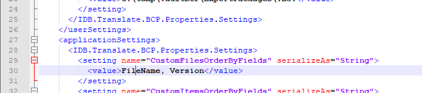

# powerload-utilities

## Disclaimer

THE SAMPLE CODE ON THIS REPOSITORY IS PROVIDED "AS IS" WITHOUT WARRANTY OF ANY KIND, EITHER EXPRESSED OR IMPLIED, INCLUDING, BUT NOT LIMITED TO, THE IMPLIED WARRANTIES OF MERCHANTABILITY, FITNESS FOR A PARTICULAR PURPOSE, OR NON-INFRINGEMENT.

THE USAGE OF THIS SAMPLE IS AT YOUR OWN RISK AND **THERE IS NO SUPPORT** RELATED TO IT.

## Overview
The powerLoad utilities are a set of utilities - based on the bcpToolkit - for loading the Autodesk Vault Workgroup or Professional.
The powerLoad utilites are:
* **powerLoad Intermediate Database (IDB):** SQL database for transforming the data to fit to the target Vault
* **IDB.Load.Files:** Utility to load files from a Windows folder to the Intermediate Database.
* **IDB.Load.BCP:** Utility to load files and folders from a BCP-package to the Intermediate Database (IDB).
* **IDB.Discover.Vault:** Utility to query Vault for existing files and replace these files in the powerLoad Intermediate Database (IDB)
* **IDB.Analyzer.Inventor:** Scans Inventor files for missing references that are listed in the IDB in the field 'LocalFullFileName'. Additionally the RefID from the reference is extracted and written back to the IDB.
* **IDB.Analyzer.AutoCAD:** Scans AutoCAD DWGs files for missing Xrefs that are listed in the IDB in the field 'LocalFullFileName'. Additionally the RefID from the reference is extracted and written back to the IDB.
* **IDB.Validate.BCP:** Utility to run the Validation scripts without starting the SQL Management Studio UI.
* **IDB.Translate.BCP:** Creates a BCP-package from the content of the Intermediate Database.

### Additions
For validating the BCP package that is created from the IDB there are additional tools:
* **bcpViewer**, which is part of the bcpToolkit
* **bcpValidator**, which can be found on https://github.com/coolOrangeLabs/bcpValidator

## Prerequsites
* Microsoft SQL Server 2014 or newer
* Windows 10
* AutoCAD and/or Inventor if the analyzer utilities are needed

## Installation
Download the ZIP powerLoad_v\<version number\>.zip from the Assets section from https://github.com/coolOrangeLabs/powerload-utilities/releases/latest.

Extract the ZIP to a folder 'powerLoad' e.g. '*C:\coolOrange\powerLoad*' on the machine, where the bcpToolkit is installed.

## Description

The Intermediate Database (IDB) is a concept that can be used to fill a neutral database with data from Vault or any other PDM system or from Windows Explorer. This IDB can be transformed into a BCP format which can be imported into Vault Professional or Vault Workgroup.   
This repository contains the IDB structure as well as tools to load the IDB and to convert the database to the Autodesk Vault BCP format. This format is finally used by Autodesk Vault Data Transfer Utility (DTU) to mass import data into Vault.

## coolOrange powerLoad Intermediate Database
The powerLoad Intermediate Database (IDB) is a SQL database template provided by coolOrange that standardizes and simplifies the transition from an existing data and file source to Vault.
This section explains how to use and fill the Intermediate Database with the information from the legacy system.

### Setting up the Intermediate Database for Vault Import

1. Open SQL Management Studio and login
2. Open script '*Create.IDB.sql*', located in the '*SQL*' sub-directory, in SQL Management Studio
3. Modify path for mdf and ldf files for your SQL installation

    Sample:
    
    Modify `FILENAME = N'C:\Program Files\Microsoft SQL Server\MSSQL14.AUTODESKVAULT\MSSQL\DATA\Load.mdf'`    
    to `FILENAME = N'C:\Program Files\Microsoft SQL Server\<My SQL instance>\MSSQL\DATA\Load.mdf'`
 4. Create the powerLoad Intermediate Database by running the script. The default name of the database is "Load".
 5. Check and deactivate option *'Prevent saving changes that require table re-creation'* from the menu *"Tools > Options..."*. 
 
 
 
 6. Refer to the Description of the [**coolOrange Intermediate Database**](https://coolorange.sharepoint.com/:w:/s/PartnerPortal/Eacw4RDePzlDvi9KktsP_EUBcQGyTPBEe1EyJ6MsXv0zTg?e=RXI7tG) to understand the database model.
 7. Enhance the Files, Folders, Items and/or CustomObjects table with additional UDP fields for transferring metadata to user defined properties (UDPs) in Vault.

   * For each property (field) of the legacy system that you want to transfer to Vault an UDP-field in the object table must be added. The name of the UDP-field can be renamed.
 
### DB Structure

   
## IDB.Load.Files
Utility to load files from Windows folders to the Intermediate Database (IDB)

### Configuration
The path with the files to import and the connect string to the SQL server and database can be set in the dialog of the IDB.Load.Files. The settings will be written back to the central configuration file **IDB.Core.ini** when the utility is started. These settings are then the default for the next time any of the powerLoad utilities are started.

In the configuration file ***IDB.Load.Files.Behaviors.ini*** the default behaviours can be set.

The delivery default is: 

* Folders: Default settings for folders. The following fields in the IDB will be filled with the assigned value for all folders.
	* Category
	* CreateUser 

* Files: Default settings for files. The following fields in the IDB will be filled with the assigned value for all files.
	* Category
	* RevisionDefinition
	* LifeCycleState
	* LifeCycleDefinition
	* RevisionLabel
	* Classification
	* CreateUser
	
	The elements must not be removed. To not fill the field just delete the value. 
E.g. `RevisionLabel=`

Please do not rename configration files.

### Usage
Start the tool with double click the file IDB.Load.Files.exe.
In the open dialog specify the ***Path*** and ***SQL Database Connection String*** to import files from the selected folder and sub-folders into the named database.

* Start: Start scan and import. The specified path and connect string are written back to the central configuration file IDB.Core.ini.
* Cancel: Stop the process. After clicking the button all records and unsaved data will be lost.
* Scan records: File`s counter of entered folder path
* Import records: Counter of already inserted files

### Logging
The default location for the log file ***IDB.Load.Files.log*** is '*C:\Users\coolOrange\AppData\Local\coolOrange\powerLoad*'. 
There you find information about successful inserts and errors.

## IDB.Load.BCP
Utility to load files and folders from a BCP-package to the Intermediate Database (IDB).

### Configuration
The path to the Vault.xml and the connect string to the SQL server and database can be set in the dialog of the IDB.Load.Files. The settings will be written back to the configuration file **IDB.Core.ini** when the utility is started. These settings are then the default for the next time any of the powerLoad utilities are started.

### Usage
 
Start the tool with double click the file IDB.Load.BCP.exe.
In the open dialog specify the Path to scan and import and the SQL Database Connection String. 

* Start: Start scan and import. The specified path and connect string are written back to the central configuration file IDB.Core.ini.
* Cancel: Stop the process. After clicking the button all records and unsaved data will be lost.
* Scan records: File`s counter of entered folder path
* Import records: Counter of already inserted files

After starting the process the utility scans the Vault.xml. It can take some time until the import starts.

### Logging
The default location for the log file ***IDB.Load.BCP.log*** is '*C:\Users\coolOrange\AppData\Local\coolOrange\powerLoad*'. 
There you find information about successful inserts and errors.

## Caution
If you want to load several bcp-packages into 1 Intermediate Database (IDB) you must remove the UNIQUE for the index [IX_Files] in order the tool does not stop when duplicate files are imported.

## IDB.Analyzer.Inventor
Utility to scan Inventor files for missing references that are listed in the IDB in the field 'LocalFullFileName'. Additionally the RefID from the reference is extracted and written back to the IDB.

### Prerequsite
This tool uses Inventor Apprentice. At least Inventor View must be installed on the machine where this tool is used.

### Configuration
In the configuration file ***IDB.Analyzer.Inventor.exe.config*** the connection to the SQL database must be set.
* At the setting ***name="ConnectionString"*** the connect string to SQL server and database must be set. Use the login information, that you use when you login with the Microsoft SQL Server Management Studio.
* At the setting ***name="WorkingDirectory*** the working directory can be modified if needed. The default is *C:\temp\IDBAnalyze\InventorData*.

Do not rename configuration files!

### Usage
Start the tool with double click the file IDB.Analyzer.Inventor.exe. A Windows console will start and the tool scans the Inventor files that are listed in the IDB in the field 'LocalFullFileName'.
The IDB.Analyzer.Inventor scans:
* File not exist
* File invalid (File cannot be opened)
* Missing references / Contains missing references
* Missing OLE reference / Contains missing OLE references
* Duplicates: Identical file names in different folders

### Logging
The default location for the log file ***IDB.Analyzer.Inventor.log*** is '*C:\Users\coolOrange\AppData\Local\coolOrange\powerLoad*'. 

## IDB.Analyzer.AutoCAD
Utility to scan AutoCAD files for missing Xrefs that are listed in the IDB in the field 'LocalFullFileName'. Additionally the RefID from the reference is extracted and written back to the IDB.

### Prerequsite
This tool uses AutoCAD Core Console. So at least AutoCAD Vanilla must be installed on the machine where this tool is used.

### Configuration
The folder where the tool is installed, must be configured in the **Trusted Locations** of the AutoCAD Options:

In the configuration file ***IDB.Analyzer.AutoCAD.dll.config*** the connection to the SQL database must be set.
* At the setting ***name="ConnectionString"*** the connect string to SQL server and database must be set. Use the login information, that you use when you login with the Microsoft SQL Server Management Studio.
* At the setting ***name="WorkingDirectory*** the working directory can be modified if needed. The default is *C:\temp\IDBAnalyze\AutoCADData*.

Do not rename configuration files!

### Usage
Open the file IDB.Analyzer.AutoCAD.ps1 with Windows PowerShell ISE and run the script. A Windows console will start and the tool scans the AutoCAD files that are listed in the IDB in the field 'LocalFullFileName'.
The IDB.Analyzer.AutoCAD scans:
* File not exist
* File invalid (File cannot be opened)
* Missing references (Xrefs) / Contains missing references

### Logging
The default location for the log file ***IDB.Analyzer.AutoCAD.log*** is '*C:\Users\coolOrange\AppData\Local\coolOrange\powerLoad*'. 

## IDB.Translate.BCP
Creates a valid BCP-package from the content of the Intermediate Database.
Therefore all information that should be transferred to Vault must be filled correctly in the according tables of the IDB.

### Prerequsite
This utility uses the bcpDevkit to create the BCP-package. Therefore it must be installed on the same machine, where the bcpToolkit is installed and licenced.

### Configuration
The default ordering of the files is 'FileName, RevsionsLabel, Version', which means that files are ordered by the value of the RevisionLable, and if there are identical values the next ordering is by Version.
The default ordering can be overwritten in the config file ***IDB.Translate.BCP.exe.config*** with the attribute "*CustomFilesOrderByFields*".
For example, if the files should be ordered by the Version only, set:

### Usage
Start the tool with double click the file IDB.Translate.BCP.exe. A dialog opens where the needed settings are set and commands are executed:

* **SQL Database ConnectionString**: Connect string to SQL server and database
* **Vault Version**: Select version of Vault in wehich will be imported. For Vault 2021 select '2020'.
* **BCP Export Directory**: Folder in which the BCP package will be exported.
* **Validate Database**: Runs the SQL script of file Validate.IDB.sql, located in the sub-folder *SQL*. 
* **Create BCP Package**: Exports the data from the IDB into a BCP package in the specified folder.

### Logging
The default location for the log file ***IDB.Translate.BCP.log*** is '*C:\Users\coolOrange\AppData\Local\coolOrange\powerLoad*'. 
There you find information about successful inserts and errors.

### Validation
With the command *Validate Database* you can run a SQL script for validating the data in the Intermediate Database. The script that is executed in in the file Validate.IDB.sql.
In this way you can add own validations to that script file and test them in the SQL Management Studio before. 
In the script 2 tables are created in the IDB:
* **Validation_Status**: Is set to 'Error' on the file, folder or file-file-relation when an error is found in the validations script for the file, folder or file-file-relation
* **Validation_Comment**: Reason or description for the error

## Product Documentation

[coolOrange bcpToolkit](https://www.coolorange.com/wiki/doku.php?id=bcptoolkit)

## Author
coolOrange s.r.l.

