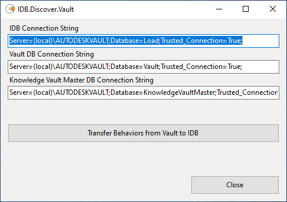

# powerload-utilities

## Disclaimer

THE SAMPLE CODE ON THIS REPOSITORY IS PROVIDED "AS IS" WITHOUT WARRANTY OF ANY KIND, EITHER EXPRESSED OR IMPLIED, INCLUDING, BUT NOT LIMITED TO, THE IMPLIED WARRANTIES OF MERCHANTABILITY, FITNESS FOR A PARTICULAR PURPOSE, OR NON-INFRINGEMENT.

THE USAGE OF THIS SAMPLE IS AT YOUR OWN RISK AND **THERE IS NO SUPPORT** RELATED TO IT.

## Overview
The powerLoad utilities are a set of utilities - based on the bcpToolkit - for loading the Autodesk Vault Workgroup or Professional.
The powerLoad utilites are:
* **powerLoad Intermediate Database (IDB):** SQL database for transforming the data to fit to the target Vault
* **IDB.Load.Files:** Command line utility to load files from a Windows folder to the Intermediate Database.
* **IDB.Load.BCP:** Command line utility to load files and folders from a BCP-package to the Intermediate Database (IDB).
* **IDB.Discover.Vault:** Utility to copy a snapshot of the target Vault configuration to the powerLoad Intermediate Database (IDB).
* **IDB.Analyzer.Inventor:** Scans Inventor files for missing references that are listed in the IDB in the field 'LocalFullFileName'. Additionally the RefID from the reference is extracted and written back to the IDB.
* **IDB.Analyzer.AutoCAD:** Scans AutoCAD DWGs files for missing Xrefs that are listed in the IDB in the field 'LocalFullFileName'. Additionally the RefID from the reference is extracted and written back to the IDB.
* **IDB.Validate.BCP:** Utility to run the Validation scripts without starting the SQL Management Studio UI.
* **IDB.Translate.BCP:** Creates a BCP-package from the content of the Intermediate Database.

### Additions
To use the powerLoad utilities you need to have the bcpToolkit installed and lisenced. 
For reviewing the BCP-package that is created from the IDB there is the tool **bcpViewer**, which is part of the bcpToolkit. Please find the description of the bcpViewer on the Product Documentation [coolOrange bcpToolkit](https://www.coolorange.com/wiki/doku.php?id=bcptoolkit).

## Prerequsites
* Microsoft SQL Server 2014 or newer
* Windows 10
* AutoCAD and/or Inventor if the analyzer utilities are needed

## Installation
Download the ZIP powerLoad_v\<version number\>.zip from the Assets section from https://github.com/coolOrangeLabs/powerload-utilities/releases/latest.

Extract the ZIP to a folder 'powerLoad' e.g. '*C:\coolOrange\powerLoad*' on the machine, where the bcpToolkit is installed.
We recommend to install the powerLoad utilities on the server and on a Vault client machine and using the utility at the machine, hat fits to the needs.

## Description

The Intermediate Database (IDB) is a concept that can be used to fill a neutral database with data from Vault or any other PDM system or from Windows Explorer. This IDB can be transformed into a BCP format which can be imported into Vault Professional or Vault Workgroup.   
This repository contains the IDB structure as well as tools to load the IDB and to convert the database to the Autodesk Vault BCP format. This format is finally used by Autodesk Vault Data Transfer Utility (DTU) to mass import data into Vault.

## coolOrange powerLoad Intermediate Database
The powerLoad Intermediate Database (IDB) is a SQL database template provided by coolOrange that standardizes and simplifies the transition from an existing data and file source to Vault.
This section explains how to use and fill the Intermediate Database with the information from the legacy system.

### Setting up the Intermediate Database for Vault Import

1. Open SQL Management Studio and login
2. Open script '*Create.IDB.sql*', located in the '*SQL*' sub-directory, in SQL Management Studio
3. Modify path for mdf and ldf files for your SQL installation

    Sample:
    
    Modify `FILENAME = N'C:\Program Files\Microsoft SQL Server\MSSQL14.AUTODESKVAULT\MSSQL\DATA\Load.mdf'`    
    to `FILENAME = N'C:\Program Files\Microsoft SQL Server\<My SQL instance>\MSSQL\DATA\Load.mdf'`
 4. Create the powerLoad Intermediate Database by running the script. The default name of the database is "Load".
 5. Check and deactivate option *'Prevent saving changes that require table re-creation'* from the menu *"Tools > Options..."*. 
 
 
 
 6. Refer to the Description of the [**coolOrange Intermediate Database**](https://coolorange.sharepoint.com/:w:/s/PartnerPortal/Eacw4RDePzlDvi9KktsP_EUBcQGyTPBEe1EyJ6MsXv0zTg?e=RXI7tG) to understand the database model.
 7. Enhance the Files, Folders, Items and/or CustomObjects table with additional UDP fields for transferring metadata to user defined properties (UDPs) in Vault.

   * For each property (field) of the legacy system that you want to transfer to Vault an UDP-field in the object table must be added. The name of the UDP-field can be renamed.
 
### DB Structure

## IDB.Core.ini
The IDB.Core.ini is the central configuration file with common settings for the utilites with 3 sections.  
* **[IDB]**: Section for the intermeadate database (IDB) 
	* **ConnectionString**: SQL Connection String to the server and database of the powerLoad IDB  
		Default: `ConnectionString=Server=(local)\AUTODESKVAULT;Database=Load;Trusted_Connection=True;` 
	* **ImportPath**: The path with the sub-folders and files to import into the intermeadate Database  
		Default: `ImportPath=C:\TEMP\Source Directory` 
	* **ExportPath**: Folder in which the BCP package will be exported.  
		Default: `C:\TEMP\VaultBCP\Target Directory` 
* **[Vault]**: Section for the target Vault database 
	* **Connection String**: SQL Connection String to the server and database of the target Vault  
		Default: `ConnectionString=Server=(local)\AUTODESKVAULT;Database=Vault;Trusted_Connection=True;`
* **[KnowledgeVaultMaster]**: Section for the Knowledge Vault Master database
	* **Connection String**: SQL Connection String to the server and Knowledge Vault Master database of the target Vault  
		Default: `ConnectionString=Server=(local)\AUTODESKVAULT;Database=KnowledgeVaultMaster;Trusted_Connection=True;`
   
## IDB.Load.Files
Command line utility to load files from Windows folders to the Intermediate Database (IDB)

### Prerequsite
This tool uses Inventor Apprentice to indentify whether DWG files are AutoCAD DWG files or Inventor DWG files. At least Inventor View must be installed on the machine where this tool is used, when the field 'ContentSource' needs to be filled during the import.

### Configuration
#### General Settings
The settings to use the utility are set in the central configuration file **IDB.Core.ini** in section [IDB]:  
* ConnectionString: SQL Connection String to the server and database of the powerLoad IDB 
* ImportPath: The path with the sub-folders and files to import into the intermeadate Database

#### Import Behavior Settings
In the configuration file ***IDB.Load.Files.Behaviors.ini*** the default behaviours can be set.

The delivery default is: 

* Files: Default settings for files. The following fields in the IDB will be filled with the assigned value for all files.
	* Category
	* RevisionDefinition
	* LifeCycleState
	* LifeCycleDefinition
	* RevisionLabel
	* Classification
	* CreateUser

* Folders: Default settings for folders. The following fields in the IDB will be filled with the assigned value for all folders.
	* Category
	* CreateUser 
	
	The elements must not be removed. To not fill the field just delete the value. 
E.g. `RevisionLabel=`

Please do not rename configration files.

### Usage
Start the tool with double click the file IDB.Load.Files.exe.
In the Windows command line window you can see the progress of the import.

Files of a second run with the same filename in the same folder will be skipped with a warining. In the log files these files can be found with the tag "WARN".  
Incase one of the parameters is not set correctly the utility will stop and show an error message in the command line window.

### Logging
The default location for the log file ***IDB.Load.Files.log*** is '*%LocalAppData%\coolOrange\powerLoad*'. 
There you find information about successful inserts and errors.

## IDB.Load.BCP
Command line utility to load files and folders from a BCP-package to the Intermediate Database (IDB).

### Configuration
The settings to use the command line utility are set in the central configuration file **IDB.Core.ini** in section [IDB]:  
* ConnectionString: SQL Connection String to the server and database of the powerLoad IDB
* ImportPath: Folder from which the Vault.xml from the BCP package will be imported.

### Usage
Start the tool with double click the file IDB.Load.BCP.exe.
In the Windows command line window you can see the progress of the import.

After starting the process the utility scans the Vault.xml. If the utility is run again, identical files and folders will be skipped with a warining. In the log files these files can be found with the tag "WARN".  
Incase one of the parameters is not set correctly the utility will stop and show an error message in the command line window.

### Logging
The default location for the log file ***IDB.Load.BCP.log*** is '*%LocalAppData%\coolOrange\powerLoad*'. 
There you find information about successful inserts and errors.

## IDB.Discover.Vault
Utility to query the target Vault and copy a snapshot of the target Vault configuration to the powerLoad Intermediate Database (IDB), that can be used for the validations. If the configuration of the target Vault changes the IDB.Discover.Vault must be run again.

### Usage
 
Start the tool with double click the file Discover.Vault.exe to open the dialog.

* **IDB Connection String**: SQL Connection String to the server and database of the powerLoad IDB 
* **Vault DB Connection String**: SQL Connection String to the server and database of the target Vault
* **Knowledge Vault Master DB Connection String**: SQL Connection String to the server and Knowledge Vault Master database of the target Vault

* **Transfer Behaviors from Vault to IDB**: Starts to query the target Vault configuration and imports the found behaviors, users and files to the tables 'TargetVaultCategories', 'TargetVaultFiles', 'TargetVaultLifeCycles', 'TargetVaultProperties', 'TargetVaultRevisions' and 'TargetVaultUsers'.  
The specified connection strings are written back to the central configuration file IDB.Core.ini. 
A dialog box appears after the transfer is finished with the message "Successfully transferred target Vault behaviors to IDB". 

### Logging
The default location for the log file ***IDB.Discover.Vault.log*** is '*%LocalAppData%\coolOrange\powerLoad*'. 
There you find information about successful inserts and errors.

## IDB.Analyzer.Inventor
Command line utility to scan Inventor files for missing references that are listed in the IDB in the field 'LocalFullFileName'. Additionally the RefID from the reference is extracted and written back to the IDB.

### Prerequsite
This tool uses Inventor Apprentice. At least Inventor View must be installed on the machine where this tool is used.

### Configuration
In the configuration file ***IDB.Core.ini*** the connection to the powerLoad IDB must be set in section [IDB], if not already set by the utility IDB.Load.Files or IDB.Load.BCP.

In the configuration file ***IDB.Analyzer.Common.ini*** there are two settings in the section [IDB.Analyzer] that need to be set.
* **InventorProjectFile**: Inventor project file (IPJ) which is used for the scan. If not set, the current IPJ file in Inventor is used. We reccommend to set the project file, to avoid untrustworthy behavior.
* **WorkingDirectory**: The working directory for the utility. The default value is *C:\temp\IDBAnalyze\InventorData*.

Do not rename configuration files!

### Usage
Start the tool with double click the file IDB.Analyzer.Inventor.exe. A Windows console will start and the tool scans the Inventor files that are listed in the IDB in the field 'LocalFullFileName'.
The IDB.Analyzer.Inventor scans:
* File not exist
* File invalid (File cannot be opened)
* Missing references / Contains missing references
* Missing OLE reference / Contains missing OLE references
* Duplicates: Identical file names in different folders

### Logging
The default location for the log file ***IDB.Analyzer.Inventor.log*** is '*%LocalAppData%\coolOrange\powerLoad*'.  
In the logfile the scan results are listed. Files with an error will get marked with "ERROR", files with a warning with "WARN".

## IDB.Analyzer.AutoCAD
Command line utility to scan AutoCAD files for missing Xrefs that are listed in the IDB in the field 'LocalFullFileName'. Additionally the RefID from the reference is extracted and written back to the IDB.  

### Prerequsite
This tool uses AutoCAD Core Console. So at least AutoCAD Vanilla must be installed on the machine where this tool is used.

### Configuration
The folder where the tool is installed, must be configured in the **Trusted Locations** of the AutoCAD Options:

In the powerShell file ***IDB.Analyzer.AutoCAD.ps1*** you need to specify the AutoCAD version that is installed in section *Settings* in line:  
`$accoreconsole = "C:\Program Files\Autodesk\AutoCAD `***2020***`\accoreconsole.exe"`

If wanted, you also can change the working directory in line:  
`$workingDirectory = "C:\Temp\IDBAnalyze\AcadXrefAnalysis"`  
Thre is no need to change the lines:  
`$scriptfile = "$workingDirectory\IDB.Analyze.AutoCAD.scr"`  
`$batchfile = "$workingDirectory\IDB.Analyze.AutoCAD.bat"`  
`$xrefAnalysisMode = "NORMAL"` 

Do not rename configuration files!

### Usage
Open the file ***IDB.Analyzer.AutoCAD.ps1*** with Windows PowerShell ISE and run the script. A Windows console will start and the tool scans the AutoCAD files that are listed in the IDB in the field 'LocalFullFileName'.
The IDB.Analyzer.AutoCAD scans:
* File not exist
* File invalid (File cannot be opened)
* Missing references (Xrefs) / Contains missing references

### Logging
The default location for the log file ***IDB.Analyzer.AutoCAD.log*** is '*%LocalAppData%\coolOrange\powerLoad*'.  
In the logfile the scan results are listed. Files with an error will get marked with "ERROR", files with a warning with "WARN". 

## IDB.Validate.BCP
Utility to run the Validation scripts without starting the SQL Management Studio UI.

### Usage
Start the tool with double click the file IDB.Validate.BCP to open the dialog.

* **IDB SQL Connection String**: SQL Connection String to the server and database of the powerLoad IDB

* **Validate Database**: Runs the SQl script ***Validate.IDB.sql*** and writes back the results into the fields "**Validation_Status**" and "**Validation_Comment**" in the intermediate Database. 
A dialog box appears after the transfer is finished, telling whether errors were found.

### Validations
In the SQl script file ***Validate.IDB.sql*** there are alredy a lot of validations to prove the data in the IDB that a valid BCP-package can be created.
Use these SQL scripts a samples and extend them to your needs.
The following validations are delivered in the ***Validate.IDB.sql***:

#### Validations for Folders
* User-Validation: Checks whether the user in field 'CreateUser' exists in the snapshot oi the target Vault (TargetVaultUsers).
* Duplicate-Folder-Validation: Search for duplicate foldres.
* Mandotary-Data-Validation: Checks whether mandatury fields like FolderName, Category and CreateDate are filled
* Validation for endless loop: Check for cyclic references that would end up in an endless loop
* Category-Validation: Validation whether Categorys do exist in target Vault
* LifecycleDefinition-Validation: Validation whether LifecycleDefinitions do exist in target Vault
* LifecycleState-Validation: Validation whether LifecycleStates do exist in target Vault for assigned LifecycleDefinition
* UDP-Validation: Validation whether UPDs do exist in target

#### Validations for Files
* User-Validation: Checks whether the user in field 'CreateUser' exists in the snapshot oi the target Vault (TargetVaultUsers).
* Mandotary-Data-Validation: Checks whether mandatury fields like FolderName, Category and CreateDate are filled
* Filename-Validation: Checks whether full filename is longer than 260 characters
* Category-Validation: Validation whether Categorys do exist in target Vault
* LifecycleDefinition-Validation: Validation whether LifecycleDefinitions do exist in target Vault
* LifecycleState-Validation: Validation whether LifecycleStates do exist in target Vault for assigned LifecycleDefinition
* RevisionDefinition-Validation: Validation whether RevisionDefinitions do exist in target Vault
* UDP-Validation: Validation whether UPDs do exist in target

#### Validations for FileFileRelation
* Dependency/Attachment-Validation: Checks whether FileFileRelation  either field 'IsDependency' or 'IsAttachment' is set to 'True', but both do not have the same value.
* RefId-Validation: check whether RefId IS NOT filled, when 'IsDependency' is 'true'

### Logging
The default location for the log file ***IDB.Validate.BCP.log*** is '*%LocalAppData%\coolOrange\powerLoad*'. 

## IDB.Translate.BCP
Creates a valid BCP-package from the content of the Intermediate Database.
Therefore all information that should be transferred to Vault must be filled correctly in the according tables of the IDB.

### Prerequsite
This utility uses the bcpDevkit to create the BCP-package. Therefore it must be installed on the same machine, where the bcpToolkit is installed and licenced.

### Configuration
The default ordering of the files is 'FileName, RevisionLabel, Version', which means that files are ordered by the value of the RevisionLable, and if there are identical values the next ordering is by Version.
The default ordering can be overwritten in the config file ***IDB.Translate.BCP.ini*** in the section "*[CustomOrderSettings]*".
For example, if the files should be ordered by the Version only, set:  
`CustomFilesOrderByFields=FileName, Version` 

### Usage
Start the tool with double click the file IDB.Translate.BCP.exe. A dialog opens where the needed settings are set and commands are executed:

* **IDB SQL ConnectionString**: Connect string to SQL server and intermediate database
* **Vault Version**: Select version of Vault in wehich will be imported. For Vault 2021 select '2020'.
* **BCP Export Directory**: Folder in which the BCP package will be exported.
* **Disable Configuration Export**: If active the Vault configuration sections 'Security' and 'Behaviors' are not filled to the generated Vault.xml. We recommend to use this setting, to avoid unintentional overwriting configuration settings in the target Vault.
* **Create BCP Package**: Exports the data from the IDB into a BCP package in the specified folder.

### Logging
The default location for the log file ***IDB.Translate.BCP.log*** is '*%LocalAppData%\coolOrange\powerLoad*'. 
There you find information about successful inserts and errors.

## Logging Settings
The default location for the log files is '*%LocalAppData%\coolOrange\powerLoad*'. 
The size and the number of the log file and how detailed the logging is written can be set in the files with  extension log4net. 
To increase the size of the logfile increase the value of line:  
`<param name="MaximumFileSize" value="20mb" />`  
To increase the number of the logfile before they are overwritten increase the value of line:  
`<param name="MaxSizeRollBackups" value="20" />`  
To get more detailed information into the logfile change the value of the level value to "**DEBUG**" or "**ALL**":  
`<level value="INFO" />` 

**Note:** With setting "DEBUG" or "ALL" the log-files are getting very big and the performance decreases. Therefore use these settings only for analysis when running into issues. 

## Product Documentation

[coolOrange bcpToolkit](https://www.coolorange.com/wiki/doku.php?id=bcptoolkit)

## Author
coolOrange s.r.l.

